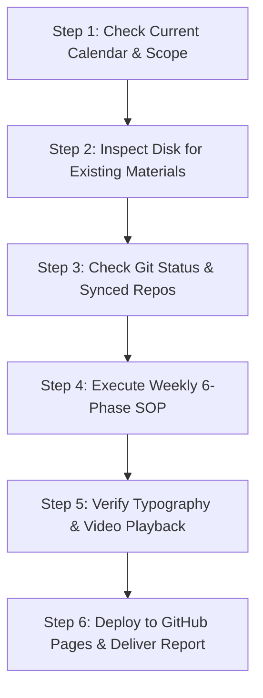

# Grade 9 Agent Master Operating Manual & Weekly Playbook
**Scope**: Cobb County High School Grade 9 (Antony)  
**Permanent Archive Location**: `/Volumes/Backup/Antony/HighSchool/Grade9`  
**GitHub Pages Web Mirror**: `/Users/anish/ap-precalc-streams` → `https://megaantony.github.io/ap-precalc-streams/`  
**Target Subjects**: AP Precalculus, Biology Honors, AP Human Geography, Intro to Software Tech  

---

## 0. Quick Resume Protocol (Start Here After Restart)

When the user asks you to **"refer to agent.md and help me"**, follow this exact diagnostic sequence:



1. **Identify the Target Week & Subject**:
   - Check current date.
   - Read the corresponding syllabus or weekly agenda in:
     - `/Volumes/Backup/Antony/HighSchool/Grade9/Math/AP Precalculus/Weekly Plans/`
     - Or the target subject's folder (`Biology-Honors-V2`, `HumanGeography`, etc.).
   - Confirm upcoming quizzes, tests, homework deadlines, or identity drills.
2. **Audit Local Assets**:
   - Check if all required worksheets, answer keys, and teacher videos for that lesson already exist on disk.
   - If any are missing or link to expiring cloud streams, run the extraction playbooks below.
3. **Sync Check**:
   - Run `cd /Users/anish/ap-precalc-streams && git status` to verify synchronization.

---

## 1. Weekly 6-Phase Standard Operating Procedure (SOP)

Every week or for every upcoming quiz/test, the agent must execute these 6 phases:

### Phase 1: Syllabus & Scope Detection
- Read the teacher's lesson plans, calendar, and assignment list.
- Pinpoint:
  1. Exact test/quiz dates and formats.
  2. Required lessons, sections, and worksheets.
  3. Daily drills (e.g. Trig Identities TD 23–25).
  4. Online assignments (DeltaMath, Edgenuity, etc.).

### Phase 2: 100% Zero-Auth Local Extraction
Never rely on live school logins during study sessions. All assets must be downloaded and archived locally:
- **Worksheets & Answer Keys**: Downloaded as clean PDFs (see [Section 4](#4-playbook-a-downloading-protected-pdfs--worksheets)).
- **Teacher Video Lessons (MyVRSpot)**: Extracted and downloaded as full `.mp4` files into the unit folder (see [Section 5](#5-playbook-b-downloading-protected-cloudfront-videos-myvrspot)).
- **External Video Lessons (YouTube)**: Extracted as clean 11-character video IDs for embedding without ads or tracking.

### Phase 3: Comprehensive Markdown Master Study Guide
Create a master Markdown study guide in the assessment subfolder:
- **Pillar-Based Concept Breakdown**: Deep, rigorous explanations covering:
  - Exact algebraic/geometric rules.
  - Strict domain/range constraints.
  - Out-of-bounds traps and common student pitfalls.
- **Identity & Formula Banks**: Memorization drills formatted cleanly.
- **10-Question Self-Test Simulation**: Realistic exam-level problems with full, step-by-step worked solutions.
- **2-Day Hour-by-Hour Study Schedule**: Concrete daily roadmap leading up to test morning.

### Phase 4: Publication-Grade Interactive HTML Study Portal
Build a modern dark-mode HTML study portal:
- **Interactive Mastery Checklist**: Checkboxes linked to a dynamic progress bar (`0%` to `100%`) with direct action buttons (`[▶ Play Video]`, `[📄 PDF]`, `[🔑 Answer Key]`).
- **Interactive Video Theater**: Responsive 16:9 player embedded at the top of the video section with smooth scrolling.
- **Dual-Mode Video Engine**:
  - Automatically plays local `.mp4` files offline when opened from disk (`file://`).
  - Automatically falls back to responsive embeds (`youtube-nocookie.com` or MyVRSpot) when hosted online.
  - Provides instant toggle buttons in the theater header (`[💾 Local MP4]` vs `[🌐 Web Stream]`).
- **Accordion Active Recall Questions**: Collapsible question cards with hidden answers so Antony can self-test before revealing solutions.
- **Mathematical Typography Standards**: (See [Section 7](#7-mathematical-typography--rendering-standards)).

### Phase 5: Visual QA & Media Verification
- Verify that every video in the checklist plays properly without 403 errors.
- Verify that math typography renders clean vertical fractions and continuous square roots (no raw LaTeX strings or flat monospace code blocks).
- Test layout on desktop and mobile viewports.

### Phase 6: Cloud Mirror & GitHub Pages Deployment
- Copy the final HTML portal and all PDFs to `/Users/anish/ap-precalc-streams/`.
- Add link in `index.html` navigation bar (e.g. `🔥 Unit X Quiz Hub`).
- Ensure `*.mp4` is ignored in `.gitignore` (large videos stay local on disk).
- Commit and push to `origin/main`.
- Verify live deployment using `curl -I https://megaantony.github.io/ap-precalc-streams/<portal>.html`.

---

## 2. Directory Structure & File Standards

All permanent course assets belong strictly under `/Volumes/Backup/Antony/HighSchool/Grade9/`:

```
/Volumes/Backup/Antony/HighSchool/Grade9/
├── agent.md                                             # This Master Operations Manual
├── Math/
│   └── AP Precalculus/
│       ├── Unit 1 - Unit Circle/
│       ├── Unit 2 - Graphing Trigonometric Functions/
│       ├── Unit 3 - Inverse & Composite Trigonometric Functions/
│       │   └── Unit 3 Quiz-9-22/
│       │       ├── Unit_03_Quiz_Master_Study_Guide.md   # Markdown Master Guide
│       │       ├── Unit_03_Quiz_Study_Portal.html       # Interactive Study Portal
│       │       ├── tex-svg.js                           # Offline MathJax SVG Engine
│       │       ├── Video_1_Review_of_Inverses.mp4       # 100% Local Offline Video
│       │       └── Video_4_Composite_Trig_Part1.mp4     # 100% Local Offline Video
│       └── Weekly Plans/
├── Biology-Honors-V2/
├── HumanGeography/
└── Intro to Software Tech/
```

---

## 3. Playwright MCP Configuration & Setup

When interacting with dynamic school Single Page Apps (CTLS, Cobb County Microsoft Azure SSO, Canvas):

```json
{
  "mcpServers": {
    "playwright": {
      "command": "npx",
      "args": ["-y", "@modelcontextprotocol/server-playwright"],
      "env": { "HEADLESS": "true" }
    }
  }
}
```

- **Persistent Profile**: Use `--user-data-dir="/Users/anish/.school-browser-profile"` to preserve SSO cookies and avoid repeated multi-factor authentication (MFA).

---

## 4. "Act Like a Human" Anti-Bot Protocol

> [!CAUTION]
> **CRITICAL RULE**: Never execute automated bursts. School Web Application Firewalls (AWS WAF, Cloudflare, Akamai) monitor request velocity and immediately issue IP rate-limits or CAPTCHAs if requests appear machine-generated.

1. **Human-Paced Delays**: Inject 1.8s–4.5s random pauses between page navigations and clicks:
   ```python
   import time, random
   time.sleep(random.uniform(2.0, 4.2))
   ```
2. **Download Throttling**: Never download multiple PDFs in parallel. Limit to **1 file every 2.5 to 5.0 seconds**.
3. **Human Typing Simulation**: Type queries with 50ms–150ms keystroke jitter instead of instant form fills.
4. **Natural Scrolling & Hovering**: Scroll incrementally (`window.scrollBy({ behavior: 'smooth' })`) and hover over buttons for 200–400ms before clicking.
5. **Authentic Browser Viewport**: Use desktop dimensions (`1440x900` or `1920x1080`) and real macOS Safari/Chrome User-Agents.
6. **Headed Fallback for MFA**: If a 2FA prompt appears, switch Playwright to headed mode or attach via Chrome Remote Debugging (`--remote-debugging-port=9222`) for a one-time human login.

---

## 5. Playbook A: Downloading Protected PDFs & Worksheets

1. **Capture Session Cookies**: From an authenticated browser network request, grab the `Cookie` header:
   ```http
   Cookie: AWSALBTG=...; AWSALBTGCORS=...; PHPSESSID=...; _csrf=...
   ```
2. **Human-Paced Batch Download**:
   ```python
   import time, random, requests

   cookies = {'AWSALBTG': '<COOKIE>', 'AWSALBTGCORS': '<COOKIE>'}
   headers = {'User-Agent': 'Mozilla/5.0 (Macintosh; Intel Mac OS X 10_15_7) AppleWebKit/537.36'}
   docs = {
       "Worksheet.pdf": "https://school.portal.url/Worksheet.pdf",
       "Answer_Key.pdf": "https://school.portal.url/Answer_Key.pdf"
   }

   for filename, url in docs.items():
       time.sleep(random.uniform(2.5, 4.5)) # Human delay
       r = requests.get(url, cookies=cookies, headers=headers, stream=True)
       if r.status_code == 200:
           with open(filename, 'wb') as f:
               for chunk in r.iter_content(chunk_size=8192):
                   f.write(chunk)
           print(f"Downloaded: {filename}")
   ```
3. **Verify File Headers**: Confirm file is a genuine PDF (`file filename.pdf`).

---

## 6. Playbook B: Downloading Protected CloudFront Videos (MyVRSpot)

Direct links to CloudFront MP4s (`d1drabmetuo3qr.cloudfront.net/....mp4?Expires=...`) expire quickly. **Never hardcode direct CloudFront signed links.**

1. **Extract Fresh Stream from Iframe**:
   MyVRSpot embed endpoints (`https://live.myvrspot.com/iframe?v=<MEDIA_ID>`) dynamically generate fresh, valid CloudFront signatures in real-time.
2. **Download Automation Script**:
   ```python
   import re, requests

   def download_myvrspot_mp4(media_id, output_filename):
       res = requests.get(f"https://live.myvrspot.com/iframe?v={media_id}")
       matches = re.findall(r'https://d1drabmetuo3qr\.cloudfront\.net/[^\'\"\s]+\.mp4\?[^\'\"\s]+', res.text)
       if not matches:
           raise ValueError("No signed CloudFront stream found.")
       
       stream_url = matches[0].replace("&amp;", "&")
       print(f"Streaming from CloudFront: {stream_url[:65]}...")
       
       with requests.get(stream_url, stream=True) as stream_res:
           stream_res.raise_for_status()
           with open(output_filename, 'wb') as f:
               for chunk in stream_res.iter_content(chunk_size=1048576):
                   f.write(chunk)
       print(f"Saved: {output_filename}")
   ```

---

## 7. Mathematical Typography & Rendering Standards

AP Precalculus materials must display authentic mathematical typography. **Do not display raw unrendered LaTeX markup (`$\frac{\pi}{2}$`) or flat monospace code (`tan(2θ) = 2tan θ / (1 - tan²θ)`).**

### CSS Typography Engine
Every study portal must include this CSS:
```css
/* Authentic Math Serif Typography */
.math {
    font-family: 'Cambria Math', 'STIX Two Math', 'Times New Roman', Georgia, serif;
    font-size: 1.08em;
    color: #ffffff;
}

/* Stacked Vertical Fractions */
.frac {
    display: inline-flex;
    flex-direction: column;
    vertical-align: middle;
    text-align: center;
    padding: 0 3px;
    font-size: 0.88em;
    line-height: 1.05;
}
.frac-num {
    border-bottom: 1.5px solid currentColor;
    padding-bottom: 1px;
    font-weight: 500;
}
.frac-den {
    padding-top: 1px;
    font-weight: 500;
}

/* Square Root Radicals with Continuous Vinculum */
.radical {
    display: inline-flex;
    align-items: center;
    vertical-align: middle;
}
.rad-sym {
    font-size: 1.35em;
    line-height: 1;
    margin-right: 1px;
    vertical-align: -0.1em;
}
.rad-body {
    border-top: 1.5px solid currentColor;
    padding: 2px 4px 0 2px;
    display: inline-flex;
    align-items: center;
}
```

### HTML Implementation Patterns:
- **Fraction**: `<span class="frac"><span class="frac-num">2 tan θ</span><span class="frac-den">1 − tan²θ</span></span>`
- **Square Root**: `<span class="radical"><span class="rad-sym">&radic;</span><span class="rad-body"><span class="frac"><span class="frac-num">1 − cos u</span><span class="frac-den">2</span></span></span></span>`
- **Offline MathJax**: Bundle local `tex-svg.js` in the folder for 100% offline vector rendering.

---

## 8. Multi-Subject Expansion Guide

This exact architecture applies across all of Antony's Grade 9 courses:

| Course | Key Folder | Primary Asset Types | Study Portal Components |
| :--- | :--- | :--- | :--- |
| **AP Precalculus** | `Math/AP Precalculus/` | Worksheets, Solution Keys, Teacher Videos, DeltaMath | Formula Banks, Unit Circle exact values, Graph models, Step-by-step simulations. |
| **Biology Honors** | `Biology-Honors-V2/` | Lab manuals, Concept Maps, Diagrams, Vocabulary | Cell/Genetics diagrams, Vocabulary flashcard grids, Practice multiple-choice simulations. |
| **AP Human Geography** | `HumanGeography/` | Models, Case Studies, FRQ Rubrics, Maps | Demographic Transition Models, Map analyses, FRQ step-by-step templates. |
| **Intro to Software Tech**| `Intro to Software Tech/` | Python/HTML projects, Quizzes, Specs | Code snippets, Live output previews, Algorithm walkthroughs. |

---

## 9. Git Repository Rules (`ap-precalc-streams`)

- **Repo Path**: `/Users/anish/ap-precalc-streams/`
- **Remote**: `https://github.com/MegaAntony/ap-precalc-streams.git`
- **Branch**: `main`
- **Git Ignore Policy**: Keep `*.mp4` in `.gitignore` at all times. Large binary videos stay on the local drive (`/Volumes/Backup/...`), while HTML study portals, CSS, SVGs, and PDFs are committed to GitHub for web access.
- **Verification Command**: After every push, run:
  ```bash
  curl -s -I "https://megaantony.github.io/ap-precalc-streams/<new_portal>.html" | head -n 5
  # Verify HTTP/2 200 OK
  ```
